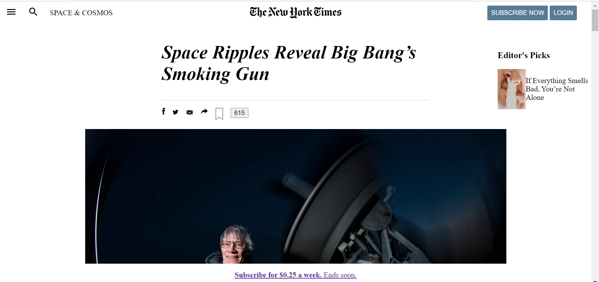

# NewYorkTimesArticleClone

> New York Times Article page clone.

The page is recreated using the position, float, box mode and flexbox features of CSS3 and HTML5 tags.

## Built With

- HTML5
- CSS3
- VS Code

## Live Demo

[Live Demo Link](https://swengineermwi.github.io/NewYorkTimesArticleClone/)

## Getting Started

To get a local copy up and running follow these simple example steps.

### Prerequisites

- You must have git installed

### Install

- Clone the git repository

### Usage

- Open HTML index file from localhost

## Author

- GitHub: [@Mwila-Kaunda](https://github.com/Mwila-Kaunda)
- Twitter: [@MwilaKaunda](https://twitter.com/MwilaKaunda)

## 🤝 Contributing

Contributions, issues, and feature requests are welcome!

Feel free to check the [issues page](https://github.com/Mwila-Kaunda/NewYorkTimesArticleClone/issues/).

## Show your support

Give a ⭐️ if you like this project!

## Acknowledgments

- The Odin Project
- Microverse
- W3Schools